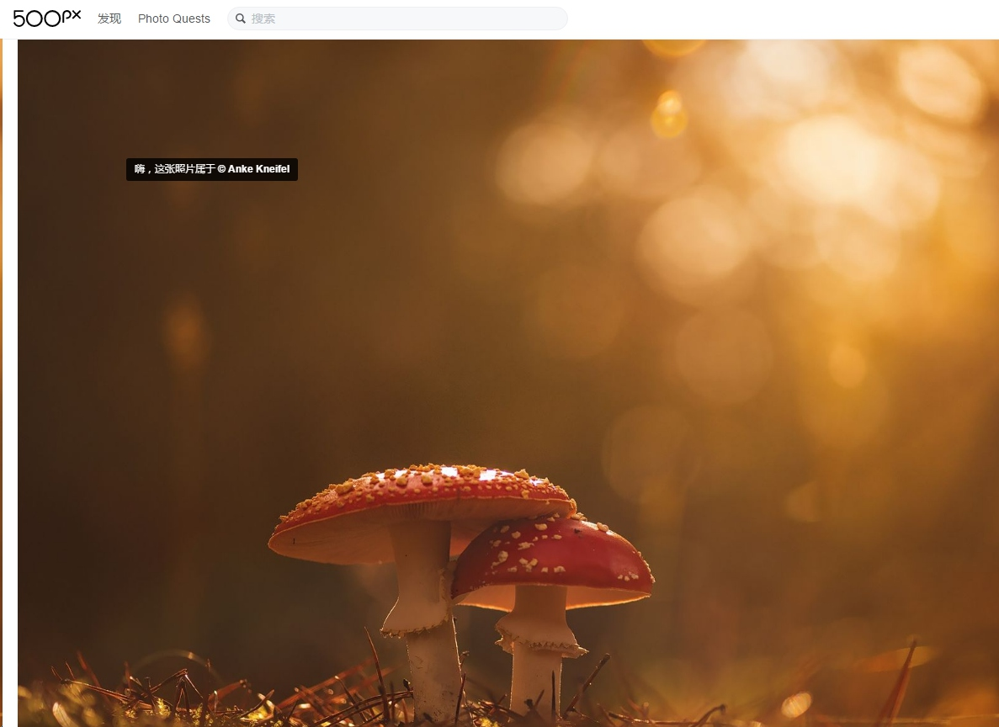
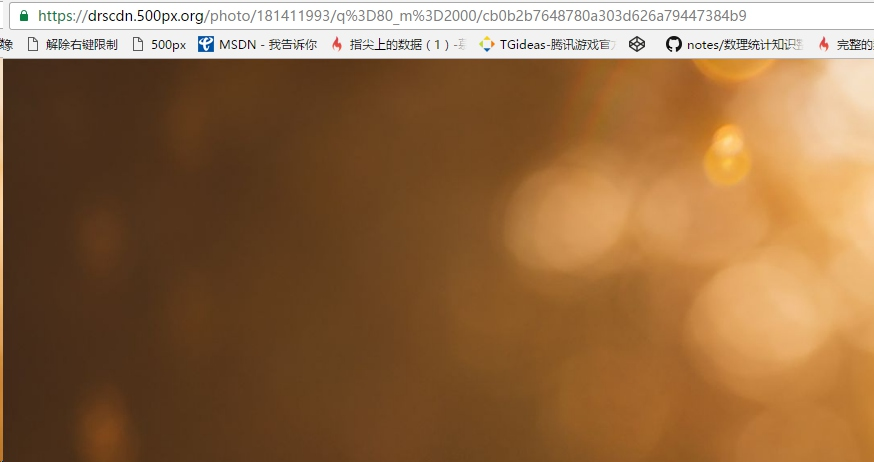
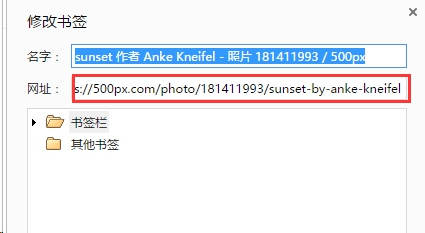
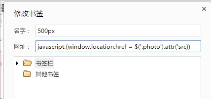
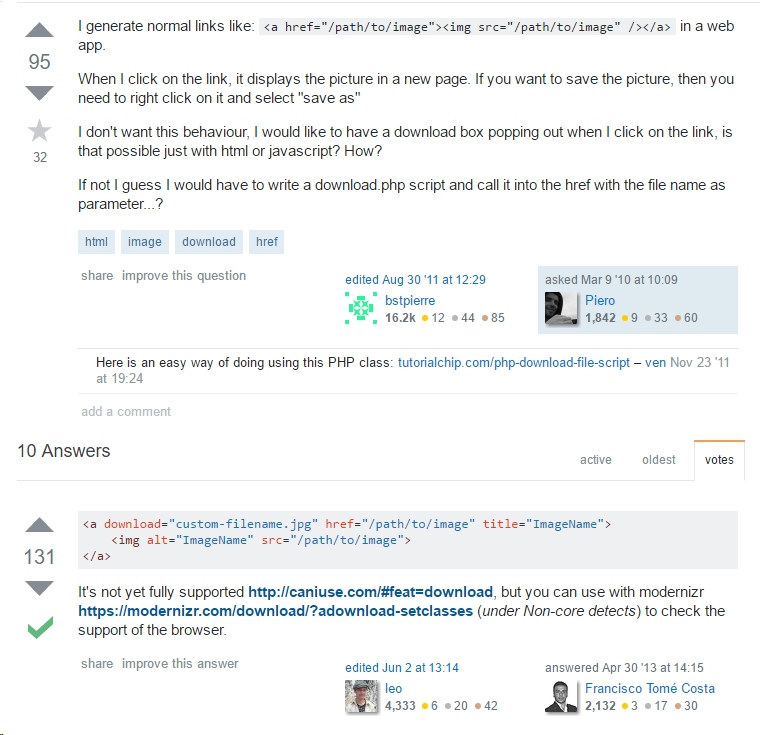
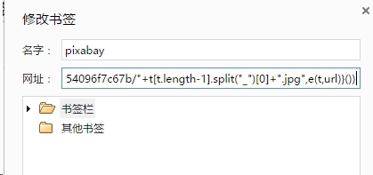
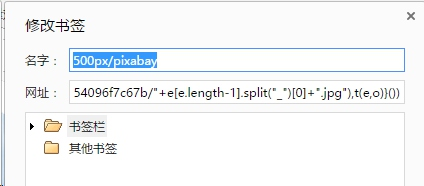

#[如何优雅地下载500px上的图片]
##500px.com
500px是一个专业的摄影师图片社区，上面有大量的高像素优质图片。很多时候在制作PPT或网页的时候需要用到里面的图片,由于网站的收费限制，当我们想要右键保存图片的时候会弹出以下的提示:


>商业用途建议购买版权图片，不建议使用文中方法

因为以上的限制，在500px下载图片的时候需要用到一些特殊的处理。

##网页结构
右键分析网页的结构，我们发现图片文件保存在一个 *class=photo* 的标签中

```

```
在地址栏中直接输入src中的内容可以看到图片内容


##跳转图片链接
这里先引入两个知识点:
1. 在浏览器中，我们输入 *javascript:(/\*一些功能代码\*/)* 可以在页面加载后执行一些js功能语句.
2. 上述功能语句可以通过收藏夹地址的方式添加，此后点击收藏夹地址即可执行相应的语句:


在以上两点基础之上，我们先获取对应图片的链接:
```
$('.photo').attr('src');
//获取结果:"https://drscdn.500px.org/photo/181411993/q%3D80_m%3D2000/cb0b2b7648780a303d626a79447384b9"
```

再加入浏览器跳转:
```
window.location.href = $('.photo').attr('src);
```
之后把这段代码转换成在地址栏执行的语句:

```
javascript:(window.location.href = $('.photo').attr('src))
```
新建一个书签，保存上述代码:



这时在500px对应的链接中点击收藏夹对应的链接，页面自动跳转到图像；

##图片文件下载
到前面为止，我们已经可以对图片右键保存了，但仍然需要多点击一次鼠标右键-保存图片，能否自动下载图片呢？
对于图片文件的保存，stackoverflow中有人给出了一种解决方案(百度搜出来的不能用):


>在现代浏览器中，a标签增加了一个download属性，允许用户点击链接后不打开链接而是下载文件，文件名即为download属性的值。

对于500px的图片我们即可通过新建链接，然后赋值相关属性，最后触发链接点击操作下载图片了:
```
function downloadFile(fileName, url) {
		var aLink = document.createElement('a');
		aLink.download = fileName;
		aLink.href = url;
		aLink.click();
	}
	var url = $('.photo').attr('src');
	var name = "stock-photo-" + url.split('photo/')[1].split('/')[0] + '.jpg';
	downloadFile(name, url);
```
将以上代码压缩:
```
javascript:(!function(){function o(o,t){var c=document.createElement("a");c.download=o,c.href=t,c.click()}var t=$(".photo").attr("src"),c="stock-photo-"+t.split("photo/")[1].split("/")[0]+".jpg";o(c,t)}())
```
保存到收藏夹，这时我们点击收藏夹后，图片将自动下载保存.

##其它网站
以上方法除了500px以外，适用于所有网站，前提是分析出对应的图片资源的特殊结构即可，比如说国内一个常用的 pixabay.com:
```
(function() {
	//window.location.href = $('.photo').attr('src');
	function downloadFile(fileName, url) {
		var aLink = document.createElement('a');
		aLink.download = fileName;
		aLink.href = url;
		aLink.click();
	}
	var name = $('[name="download"]').last().val();
	var url = 'https://pixabay.com/zh/photos/download/' + name + '?attachment';
	downloadFile(name, url);
})()
```

压缩后:

```
javascript:(function(){function e(e,t){var c=document.createElement("a");c.download=e,c.href=t,c.click()}var t=$("#media_container img").first().attr("src").split("/");url="https://pixabay.com/get/e833b90b28f1033ecd1f4603ef494496e06ae3d11eb9154096f7c67b/"+t[t.length-1].split("_")[0]+".jpg",e(t,url)}())
```



##合并功能
以上部分实现了500px 及pixabay的图片自动下载，但不同的网站需要点击不同的链接，能否实现自动识别呢？只需要通过url链接判断调用不同的url即可:
```
(function() {
		function downloadFile(fileName, url) {
		var aLink = document.createElement('a');
		aLink.download = fileName;
		aLink.href = url;
		aLink.click();
	}
	var name, url;
	var host = location.hostname.replace('.com', '');
	if (host == '500px') {
		url = $('.photo').attr('src');
		name = "stock-photo-" + url.split('photo/')[1].split('/')[0] + '.jpg';
	} else if (host == 'pixabay') {
		name = $('[name="download"]').last().val();
		url = 'https://pixabay.com/zh/photos/download/' + name + '?attachment';
	}
	downloadFile(name, url);
})();
```
压缩后:
```
javascript:(function(){function o(o,t){var a=document.createElement("a");a.download=o,a.href=t,a.click()}var t,a,c=location.hostname.replace(".com","");"500px"==c?(a=$(".photo").attr("src"),t="stock-photo-"+a.split("photo/")[1].split("/")[0]+".jpg"):"pixabay"==c&&(t=$('[name="download"]').last().val(),a="https://pixabay.com/zh/photos/download/"+t+"?attachment"),o(t,a)}())
```



#总结
本文利用浏览器中可以执行js的特点来实现相关网站图片的保存，实际使用中还应根据不同的需求来做代码的调整。