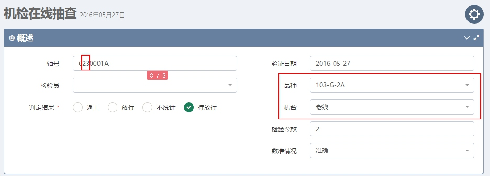
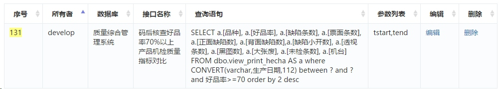
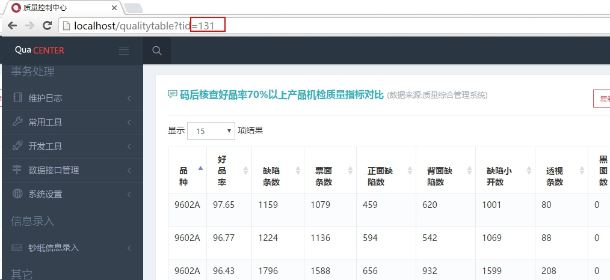

# 系统特点
***

##质量管理的一站式解决方案
>公司专业门类齐全，在质量管理中所涉及的各类系统也随工艺和品种的发展不断更新，然而有的系统也随着这种发展也进入了无法正常使用的状态，比如QIS系统、胶凹离线检测的信息系统。部分信息的查询仍需到专有的系统中完成，虽然[质量综合管理系统](http://10.8.2.133)解决了部分问题，但当时对于钞纸机检数据却仍未涉及，另外在物理站、化验站、外观指标、物检中心等环节大多仍采用纸质记录。本次任务的最终目标便是整合公司质量管理相关的所有关键点，打造质量管理工作的一站式解决方案。

***
###技术方案升级
+ 采用MVC（模型-视图-控制器）设计模式，业务逻辑和功能代码独立开发
+ 系统后台采用PHP开发，后端框架采用CodeIgniter
+ 前端框架采用BootStrap+jQuery+Metronic实现

***
###局部刷新
系统所有涉及数据交互的部分均采用AJAX技术局部刷新，这样在查询及提交数据时不用重载页面，大幅提升用户体验。
例如钞纸机检人工校验信息录入的过程中，当用户在录入轴号时，其品种及机台号将自动从轴号信息中获取和加载。轴号录入完毕时，如果系统中有历史轴号则会自动载入对应信息，而这一切均是在后台自动完成：

***
###[自由拓展](../../settings/menu)
鉴于[原系统](http://10.8.2.133)横式菜单布局在信息容量上的限制，质量控制中心采用了折叠式侧边栏方案。由于大部分用户仅关注系统中某几个点的信息，系统所有菜单均可由用户自由关闭，用户甚至可以配合系统提供的数据接口及报表和图表接口来自定义不同于质量控制中心的其它系统。
***
###[数据接口管理](../../datainterface)
+ 系统与其它数据间的数据交互采用标准JSON数据接口实现，而JSON目前已经成为互联网行业标准应用于各个领域；
+ 提供数据管理模块控制多个数据库，有新的数据库需要添加时只需做好相应配置即可使用；
+ 面向第三方用户提供[公用数据接口](../../datainterface)，开发者只需按照JSON数据标准格式便可取得系统所采集所有数据，该部分将在后续章节详细说明；
+ 系统建立大量用户视图(View)以方便有开发能力的用户使用，数据的查询上也优先从视图中读取以提供数据查询速度；

***
###[数据报表模块化](../../qualitytable)
为满足各类个性化的业务需求，系统将所有业务报表抽象为一个个独立的ID，当用户有报表需求时，仅需做几步简单的操作即可：
1. 准备一段SQL查询语句
2. 在接口管理中心定义该数据接口并获得ID值；
3. 根据接口ID添加对应菜单即可完成一个报表需求；
以上三步操作在浏览器端通过点击鼠标即可完成，大幅降低开发门槛。有一定SQL基础的技术人员便可完成报表需求的开发。当报表有调整时，只需要调整对应ID的数据接口即可。例如：

+ 我们想要查询机检质量原始数据，先准备一段SQL如下
```SQL
SELECT	a.[品种],a.[好品率],a.[缺陷条数],a.[票面条数],a.[正面缺陷数]
FROM	view_print_hecha AS a
WHERE	CONVERT (VARCHAR, 生产日期, 112) BETWEEN ? AND ? AND 好品率 >= 70
ORDER BY	2 DESC
```
+ 定义数据接口，提到ID为131


+ 以该ID添加菜单便可完成该报表功能：


***
###[数据图表模块化](../../qualitychart)
同数据报表一样，系统也提供了数据图表的模块化功能，而用法同报表模块的开发同样简单，目前实现了多达15类图表的接口化实现，这将在后续章节详细说明。

***
###信息自动推送
自2016年5月起，系统利用RTX（腾讯通）推送接口面向用户推送关键质量信息，用户在开机之后将自动接收，而这些信息也与系统的自动采集和人工录入结果实时同步。

+ 对相关高层及中层领导 ，我们目前推送印钞好品率/未检统计信息，钞纸封包率，过程质量评价控制信息；
+ 对技术人员目前推送对应工序的关键数据，同时印码工序还实时推送机台质量信息，保证信息的及时传递。

信息推送模块目前处理测试期，在主要功能开发完毕后还将不断升级。

***
###快速响应服务
由于系统采用自主开发，对于用户反馈能第一时间及时跟进，详询 8275-6129。