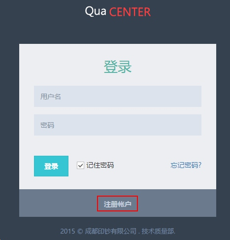
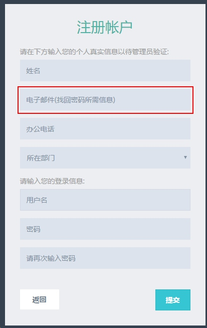
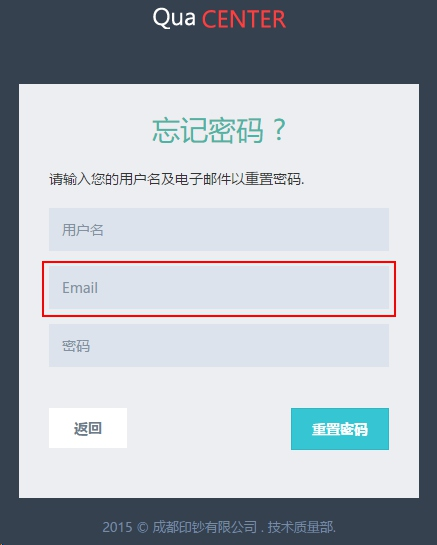
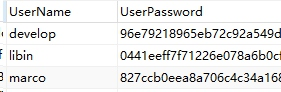
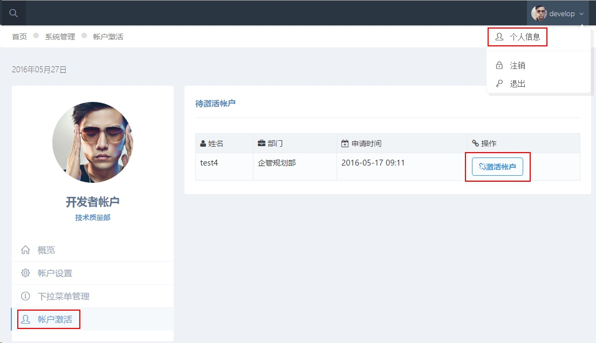
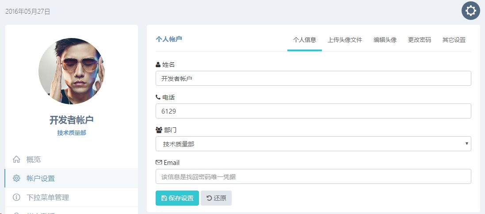
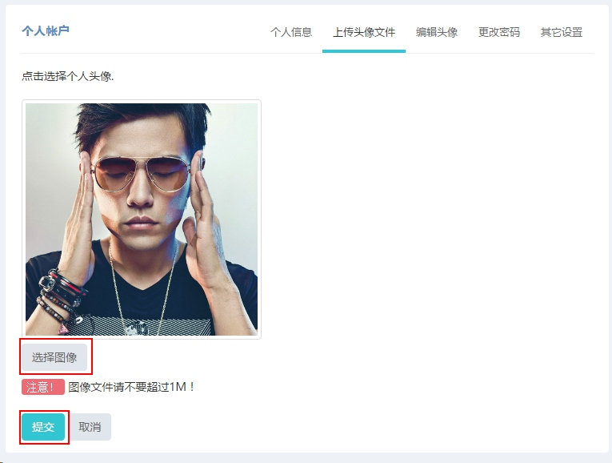

# 用户帐户管理
***

##需要先了解的
>质量控制中心全站采用HTML5开发，对于IE9.0以下的浏览器不支持，IE9.0的版本提供部分功能支持，这里推荐您使用HTML5支持度最好的[谷歌浏览器 Chrome](../chrome.exe)浏览本站。当您看到此文档时说明已安装该浏览器。

***
###为什么加入用户管理机制

1.  系统在设计之初考虑到机检日志的录入、个人工作日志的撰写、钞纸各类检测指标的录入等功能，在涉及需要记录人信息的这些功能中，用户管理机制将会是一个较好的解决方案。
2. 系统定位于公司印钞、钞纸、造币三大专业的质量信息整合，服务器位于行业管理网段，任何人均可浏览。由于涉及较多敏感数据，故通过用户管理机制加以控制。

***
###用户注册
进入系统后将自动跳转至登陆页面，未注册的用户可以点击图中的红框注册个人帐户：

用户注册时按常用的帐户注册方式即可，但需注意的是，出于管理需要，姓名请填写个人真实姓名，同时用户邮箱需谨记，这是找回密码的唯一方式：

按照系统提示填写完信息后，提交管理员审核激活帐号即可使用。

***
###密码找回
在登录主页点击密码找回按钮进入密码找回页面：

此处需输入注册时填写的邮箱地址验证个人身份信息，邮箱地址可以在个人信息中心修改。
用户密码在系统中采用MD5单向加密：

***
###帐户激活

**系统已激活用户均可激活申请激活的帐户**，已激活用户鼠标移至个人头像并点击右上角个人信息进入个人信息页面，点击左侧帐户激活选项卡可看到待激活用户列表，再点击列表右侧激活帐户即可完成：

***
###个人信息维护
鼠标移到右上角个人头像，点击个人信息后进入帐户设置页面，在这里您可以修改个人信息，同时还可编辑个人头像，重设个人密码。

####上传头像文件
这里将简单介绍个人头像的设置，进入上传头像文件选项卡，之后选择图像，再点击提交，此时用户待编辑头像文件将上传至服务器后台：

####编辑个人头像
进入编辑头像选项卡，再鼠标左键拖动裁切选区即可编辑头像。鼠标移至选区边缘可调节裁切大小，左侧实时预览裁切结果，待裁切完毕后点击下方 裁剪为头像 按钮。此时系统将自动注销，重新登录后启用新头像。

