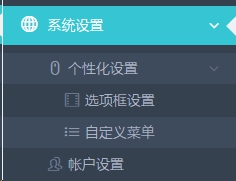
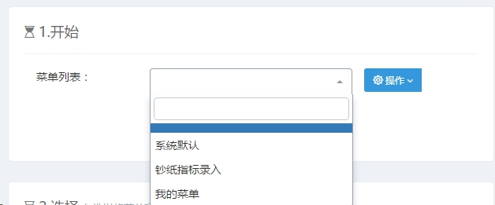
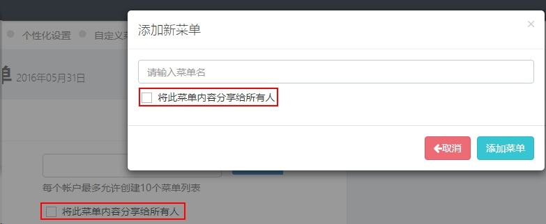
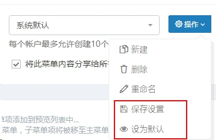
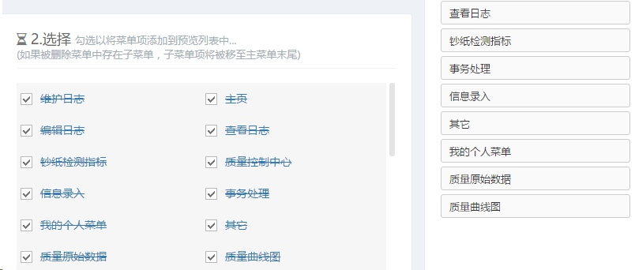
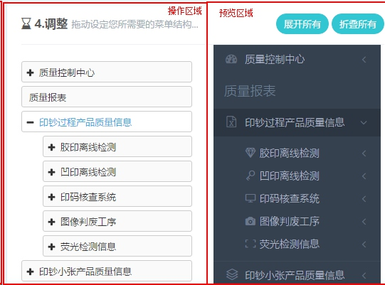
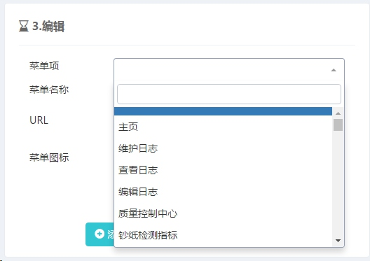
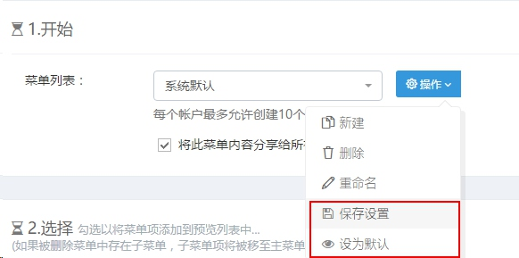
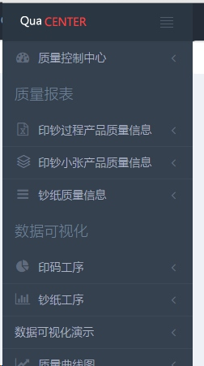
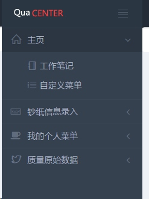

#管理你的菜单
***

##进入菜单管理模块
>菜单管理模块主要实现用户对系统不同功能模块的个性化定制的功能。

目前系统处理完善期，所有用户共享一套管理员设置的默认菜单，用户登录系统后点击左侧系统设置-个性化设置-自定义菜单可进入菜单管理模块选择个人的模块，[点击这里](http://10.8.2.133:70/settings/menu)也可进入。
[]

##建立个人菜单
进入菜单管理模块后点击菜单列表，选择相应菜单后可进行相应的编辑、删除等操作。系统默认提供的3个菜单为管理分享的菜单，用户也可新建自己的菜单供他人使用。
>需要注意的是，用户共享的菜单，除了作者外其它人只能使用、不可编辑。

点击操作下拉菜单框，选择新建按钮，系统弹出新建菜单按钮，勾选图中红框标注的部分可将该菜单分享给他人使用。

## 拷贝他人共享的菜单进行编辑
以【系统默认】菜单为例：

1. 点击菜单列表下拉框选择【系统默认】后将载入默认菜单的配置信息; 
2. 点击刚才新建的菜单【Test2】，由于【test2】中无数据，所以将默认启用刚才选择的菜单配置信息；
3. 之后可进行其余相关操作，点击保存设置将当前配置保存到你新建的菜单项中，点击设为默认将会实时应用到系统菜单栏中：

##向菜单中添加内容
在菜单项中单击列表区域将菜单项添加至右侧编辑区域，添加完毕后需要对菜单层级关系进行改变：

##调整菜单层级
菜单载入后可在下图中操作区域通过左右拖动操作改变相应的层级结构，菜单拖动后的效果将在预览区域实时预览。点击右侧调整区域中 展开所有/折叠所有 能将所有菜单展开或折叠。

##编辑菜单项
单击菜单项再选择相应菜单项后，可对菜单内容进行编辑：

菜单内容主要包括3项：

+ 菜单名称：在菜单列表中显示的名称，该项信息必填；
+ URL：该菜单链接的地址，地址只填写相对地址即可。例如某项菜单链接地址为"10.8.2.133:70/microblog"时，只填写"microblog"即可。当菜单作为树结构的根节点或仅用于显示逻辑关系时，可不填写URL地址，系统将自动添加空白地址。
+ 菜单图标：显示在链接左侧的图标，点击后用户选择即可，也可以不选择。

设置好内容后点击添加或修改即可新增或修改；
点击隐藏时该菜单将不再显示；
点击“将此菜单分享给所有人”后，刚才所编辑的菜单项将分享至其它人的菜单列表中。

##应用你的菜单
设置好菜单后点击“保存设置”将会把菜单的内容以及层级结构保存至服务器，再点击“设为默认”便可将你刚才所操作的结果重新应用。

例如：
###更换前

###更换后

