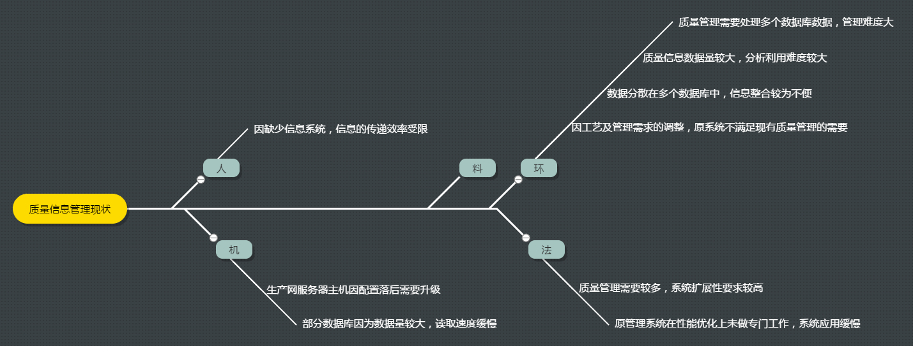
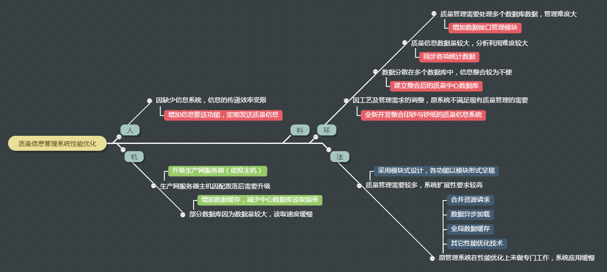
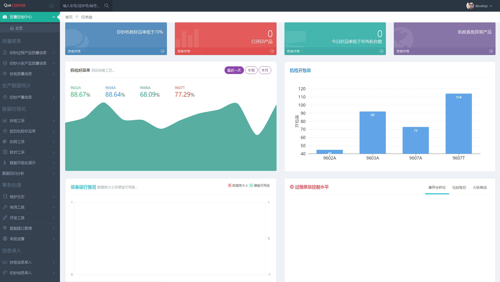
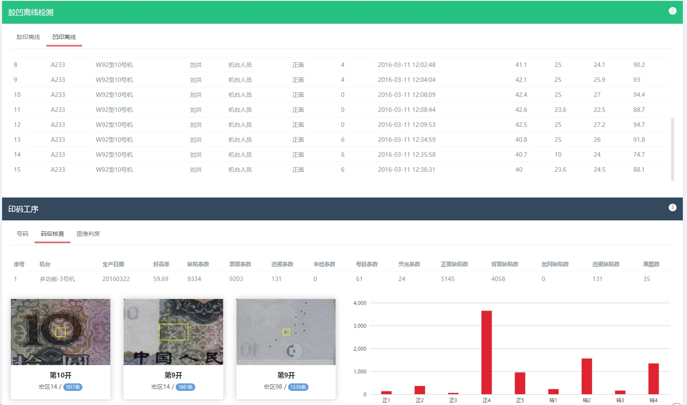
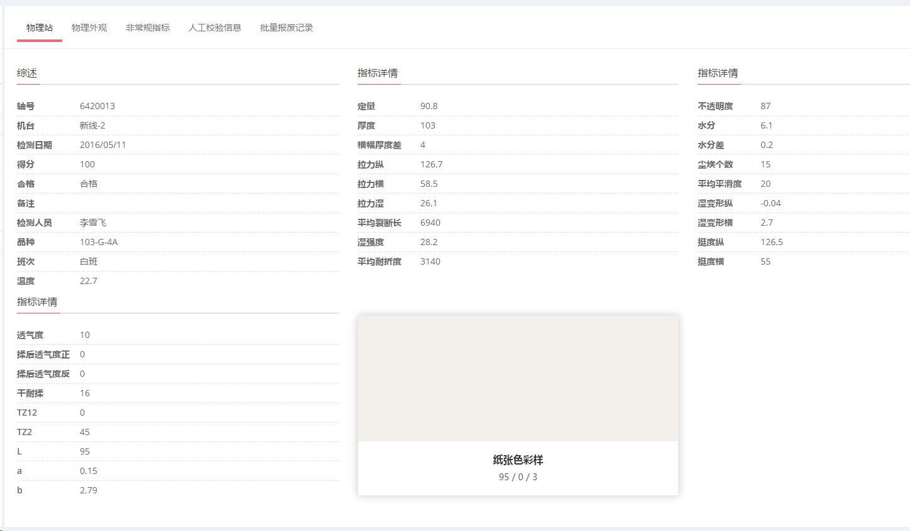

#QC项目成果汇报
###成钞公司质量信息系统
   
技术质量部 机检QC小组

----
<!-- .slide: data-background="#41b883" -->
##QC小组简介

* 黄莉(项目策划，方案制定)
* 张楠岚(项目策划，方案制定)
* 李宾(方案制定，落实措施)
* 马可(方案制定，落实措施)
* 舒粤(测试验证，数据统计)
* 陈晶(测试验证，数据统计)
* 丰锋(测试验证，数据统计)

----
##工作安排
* 1-3月:确定技术方案并完成钞纸纸机、切纸机质量信息采集上传工作。
* 4-6月:完成前端功能开发，实现系统的主要功能。
* 7-9月:系统试运行。
* 10-12月:系统完善与优化，完成各类文档总结工作。

----
##一、课题背景
>2016年初，技术质量部确定部门年度重点工作，其中一项是“建立钞纸质量信息平台，完善印钞质量数据采集，加强质量数据分析利用”，该工作内容同时也是公司2016重点工作之一，为了完成这一目标成立本QC小组。

----
<!-- .slide: data-background="#41b883" -->
##二、现状分析
* 9607T品上马后，以前QIS因为兼容性问题已进入淘汰阶段；
* 基于钞纸各项指标的基础研究需要实现各工艺环节信息的整合，但此前钞纸专业缺少信息化系统；
* 印钞专业在2014年发布的印钞质量信息系统也无法满足现有印钞与钞纸质量信息整合的需要，同时核心业务的效率缓慢。比如大量原始数据的查询，质量缺陷信息反馈等。

----
##三、要因分析
QC小组成立后，针对公司质量信息化管理的现状，主要列举出以下几类原因:

----
<!-- .slide: data-background="#41b883" -->
##四、确定目标
1. 完成以下功能的开发 [质量控制中心数据应用方案.svg](./markdown/image/质量控制中心数据应用方案.svg)
2. 核心功能在1秒以内完成信息载入。

----
##五、制定对策——系统构架图

----
##五、制定对策——系统性能优化

----
###六、系统展示

----
###印钞生产/质量信息追溯(生产信息)

----
###印钞生产/质量信息追溯(胶凹码质量信息)

----
###印钞生产/质量信息追溯(检封及**物检信息**)
产品物检信息的录入功能将在本周上线

----
##钞纸质量信息追溯

----
##钞纸质量信息追溯

----
<!-- .slide: data-background="#41b883" -->
##系统主要性能指标
我们通过以下工作确保了绝大多数应用在**0.5-1秒**以内完成页面加载，涉及到核查中心数据库大量数据的读取应用在5秒内完成。

----
##应用效果
1. 系统从数据采集到展示全部自主开发，网络与服务器部分充分利用公司现有各类资源，未增加投入。
2. 目前基本实现两大专业的质量信息化管理，为MES系统的质量模块做了大量前期基础工作。
3. 系统经过近5个月的试运行，系统运行稳定，功能可靠。

----
<!-- .slide: data-background="#41b883" -->
##下一步工作
1. 本周完成原系统最后一项功能的升级和部署，实现系统的平滑升级。
2. 目前实现了两大专业内部的信息采集与追溯，下一步完成与立体库的对接，实现对**轴号——箱号——车号**的关联。
3. 完成印钞物化检验指标的数据录入功能。

----
#感谢聆听
