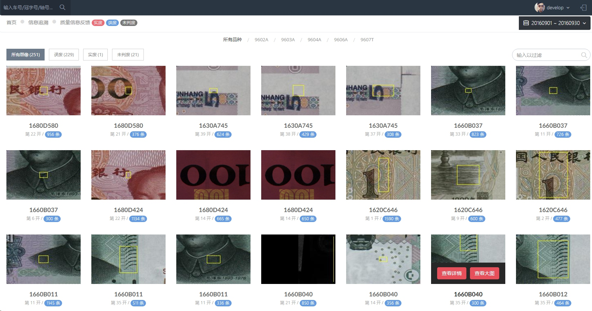
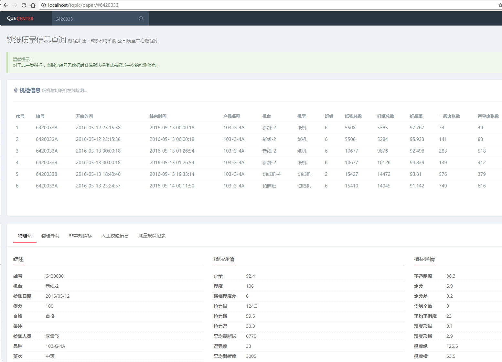

#成钞公司质量信息系统
##技术质量部 李宾

----
##背景
>2016年初，技术质量部确定本年度部门重点工作，其中一项是“建立钞纸质量数据信息化平台，完善印钞质量信息”，为了完成这一目标成立本QC小组，同时将目标定为**全新开发**。

----
##QC小组成员
* 黄莉
* 张楠岚
* 李宾
* 马可
* 舒粤
* 陈晶
* 丰锋

----
##为什么要重新开发？
两年前，我们发布了印钞质量信息系统 **http://10.8.2.133**，为什么要重新开发。

----
* 2014年为了兼容公司IE6.0的浏览器，我们放弃了许多新的功能，而这些功能在我们近两年的应用中也变得很迫切，比如数据的导出，数据图表。
* 质量数据的业务覆盖生产、质量等各类信息，目前为止与之相关的数据库有**10**个以上，在对这些数据库的管理也越来越不便。
* 以前为了完成的功能开发，没有注重性能的优化，部分业务的效率缓慢。比如大量原始数据的查询，质量缺陷信息反馈等。
* 改善用户体验及锻炼队伍

----
##完成的主要工作
> 1.钞纸全流程的质量信息追溯

> 2.印钞生产质量信息追溯

> 3.相关的各类报表 (截止至今天已完成316个)、图表(16种类型)

>4.以上所有数据的采集客户端开发

----
###系统主界面

----
###印钞生产/质量信息追溯(生产信息)

----
###印钞生产/质量信息追溯(胶凹码质量信息)

----
###印钞生产/质量信息追溯(检封及**物检信息**)
产品物检信息的录入功能将在本周上线

----
##质量信息反馈

----
##质量信息反馈(查看详情)

----
##质量信息反馈(附加信息)

----
##钞纸质量信息追溯

----
##钞纸质量信息追溯(小细节)

----
##补充说明
1. 信息追溯的入口统一在顶部搜索框中，通过冠字号、车号、轴号规则的智能匹配跳转到不同的信息。
2. 目前实现了两大专业内部的信息采集与追溯，对**轴号——箱号——车号**的关联在下一步计划中。

----
##数据报表

----
##数据图表

----
##系统主要性能指标
我们通过以下工作确保了绝大多数应用在**0.5秒**以内完成页面加载:
* 资源请求合并
* 数据缓存
* 多数据异步加载
* 其它性能优化

----
##为其它用户所做的工作

西安、南昌等客户在使用我司纸张的时候，提供独立页面供其查询全流程钞纸质量信息(无其它权限)，目前该功能尚未发布。

----
#Q&A
http://10.8.2.133:70
